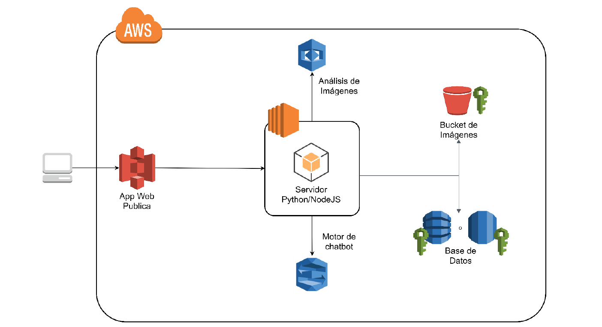

# -Semi1-Practica2_G8
# 
Universida de San Carlos de Guatemala

## 
Facultad de ingenieria

## 
Escuela de Ciencias

## 
Seminario de sistemas 1

## 
Sección B

### 
 Manual

#### 
Practica 2

### 
Grupo 9 

---
## Objetivos
* Generales
  - 
Proporcionar una guía al lector de las configuraciones, arquitectura y los usuarios necesarios para los servicios que aws nos ofrece y que fueron utilizados en el desarrollo de este proyecto

* Especificos
  - 
Implementar una arquitectura con los servicios de la nube para el funcionamiento del proyecto

  - 
Aprender a desarrollar aplicaciones en un entorno real con el uso de las tecnologías de la nube 

## Descripción de la arquitectura

La arquitectura utilizada para el desarrollo de este proyecto se puede ver de manera gráfica en la siguiente imagen, en la cual se puede observar cada uno de los elementos o servicios que nos proporciona la nube de aws y que han sido utilizados en este proyecto

    

Como podemos observar en la imagen, nuestra aplicación estara alojada en la nube de aws; de la cual haremos uso de los servicios de: 

* 
S3: Es un servicio de almacenamiento de objetos que ofrece escalabilidad, disponibilidad de datos, seguridad y rendimiento líderes en el sector 

* 
Rekognition:  ofrece capacidades de visión artificial (CV) previamente entrenadas y personalizables para extraer información a partir de las imágenes y los videos.

* 
EC2: Es un servicio web que proporciona capacidad informática en la nube segura y de tamaño modificable. Está diseñado para simplificar el uso de la informática en la nube a escala web para los desarrolladores

* 
Translate: es un servicio de traducción automática neuronal que ofrece traducción de idiomas rentable, personalizable, de alta calidad y rápida.

* 
IAM: Identity and Access Management (IAM) puede administrar el acceso a los servicios y recursos de AWS de manera segura. Además, puede crear y administrar usuarios y grupos de AWS, así como utilizar permisos para conceder o negar el acceso de estos a los recursos de AWS.

Para el desarrollo del proyecto se necesitó configurar cada uno de los servicios utilizados de una manera que todos pudieran ser utilizados en una parte especifica de nuestro proyecto, la cual es la siguiente:

Instancias EC2: Se hizo uso de 2 instancias para alojar los siguientes servicios:

  - 
En una instancia se colocó unicamente el servidor de backend en pyton. 

   - 
En la otra instancia configuramos tanto el servidor NodeJs

 
El bucket de S3 sera el encargado de alojar todos los archivos asi como las imagenes publicas para el funcionamiento de la aplicacion, este esta configurado con politicas publicas

 Se hizo uso del servicio de Amazon Rekognition, para poder obtener las etiquetas relacionadas con las publicaciones realizadas por los usuarios así como también es necesario el uso para el inicio de sesión por medio de reconocimiento facial.

Amazon Translate es utilizado para que la aplicación sea capaz de traducir las publicaciones al idioma español, este servicio esta configurado para detectar de manera automatica el idioma en el que se encuentra la publicación y traducirla al español

El diagrama Entidad relación utilizado para el desarrollo de la base de datos MySql es el siguiente.

    

## Usuarios IAM Creados

Se creo un grupo de usuarios llamado "Semi1-p2" en el cual fueron los usuarios de IAM con los cuales se realizo la creación y administración de cada uno de los servicios de aws utilizados en el desarrollo de este proyecto.

* Usuarios
  - 
rekognition_user: Usuario creado para el manejo del servicio de Rekognition, con las politicas y/o permisos asociados necesarios, los cuales son los siguientes: AmazonRekognitionFullAccess estos permisos son necesarios para que se puedan relizar las consultas necesarias a través de este servicio para el funcionamiento del proyecto.

  - 
s3-user: Usuario creado para el manejo del servicio de S3 para el bucket que ha sido necesario implementar para el almacenamiento de las imagenes y/o archivos de la aplicación. Los permisos asociados a este usuario son los siguientes: AmazonS3FullAccess.

  - 
translate-user: Usuario creado para el manejo del servicio de translate utilizado para la traducción de las publicaciones creadas por los usuarios. Los permisos asociados a este usuario son los siguientes: TranslateFullAccess.

## Conclusiones

1. 
 Actualmente los servicios que se nos ofrece en la capa gratuita de aws son bastante utiles y robustos para poder crear grandes aplicaciones tanto personales como profesionales.

2. 
Las configuraciones de los servicios si se hacen con el debido cuidado son bastante sencillas lo cual facilita su aprendizaje y el poner en marcha cualquier aplicación.

3. 
Este proyecto es bastante completo para explorar y conocer las opciones que aws nos ofrece para proyectos futuros.

